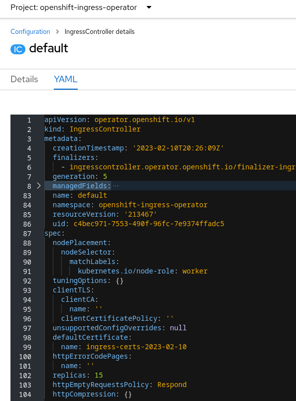

# GitOps approach to configure OpenShift clusters managed by Red Hat Advanced Configuration Management for Kubernetes, use-cases

**Authors:** Vadim Zharov, Senior Consultant, Red Hat; Suman Tripuraneni, Architect, Red Hat

**Reviewers:** Kyle Button, Principal Consultant, Red Hat

In the main article, we introduced Red Hat Advanced Cluster Management (RHACM) features and tools that cluster administrators can use to implement the GitOps approach to manage OpenShift cluster configuration. In this article, we will describe the steps to start configuring OpenShift clusters in the GitOps way and showcase use cases where cluster administrators don’t need to customize manifests before applying them to a cluster or need minimal templating. 

### Basic use case of GitOps approach: Define configuration as a set of Kubernetes YAML manifests and apply it to any managed cluster using labels.

This approach works in cases where manifests are not dependent on the cluster’s name, type or environment, etc - and can be applied using `oc apply` command, just as they are found in the OpenShift documentation.

We start with an empty repository that we want to use to configure our OpenShift clusters. And as the first step use a simple manifest to apply to a cluster that modifies **IngressController** configuration to move Ingress pods to nodes with labels `kubernetes.io/node-role: worker` :

```
apiVersion: operator.openshift.io/v1              
kind: IngressController
metadata:
  name: default
  namespace: openshift-ingress-operator
spec:
  nodePlacement:
    nodeSelector:
      matchLabels:
        kubernetes.io/node-role: worker
```

To organize YAML manifests two directories should be created - one with YAML manifests (named “***manifests***”) that will be used to configure the clusters and second with a file that will be used for Policy Generator (named configuration). Since there are usually many different manifests required to configure a cluster, manifests should be grouped into subdirectories in the “***manifests***” directory. Each subdirectory should be referenced in Policy Generator YAML file, so one generated policy in RHACM use manifests from one or more subdirectories.

Create initial directories tree:

```
[vadim@fedora rhacm-ocp-configuration]$ mkdir -p manifests/ingressconfig
[vadim@fedora rhacm-ocp-configuration]$ mkdir configuration
[vadim@fedora rhacm-ocp-configuration]$ tree
.
├── configuration
└── manifests
    └── ingressconfig

4 directories, 0 files

```

Then create IngressController manifest in ingressconfig subdirectory:

```
cat << EOF > manifests/ingressconfig/ingresconfig.yaml
apiVersion: operator.openshift.io/v1              
kind: IngressController
metadata:
  name: default
  namespace: openshift-ingress-operator
spec:
  nodePlacement:
    nodeSelector:
      matchLabels:
        kubernetes.io/node-role: worker
EOF
```

And to generate policies in RHACM create a simple configuration.yaml for Policy Generator containing requirements for all generated policies:

```
cat << EOF > configuration/configuration-policies.yaml
apiVersion: policy.open-cluster-management.io/v1
kind: PolicyGenerator
metadata:
  name: configuration-policies               # Name of policygenerator resource, never appear in any cluster including RHACM
policyDefaults:                              # Default settings for all policies listed in this YAML
  namespace: configuration-policies          # Default namespace to create policies on the ACM HUB
  remediationAction: enforce                 # Default action for policies - enforce - apply configuration
  placement:                                 # Policies will be applied to
    clusterSelectors:                        # all managed clusters which have
      base-config: "true"                    # label base-config=true assigned in RHACM
policies:                                    # List of policies to create in RHACM
  - name: ingress-configuration              # Name of the first policy to create in RHACM
    manifests:                               # For the policy - path with all manifests use to generate
      - path: manifests/ingressconfig        # (can be list of directories or path to a single YAML file) 
EOF
```

As RHACM **Policy Generator** works as a Kustomize plugin, it is necessary to create a ***kustomization.yaml*** file (in the root directory) that includes a list of the policy generator YAML files for RHACM to use:

```
cat << EOF > kustomization.yaml
generators:
  - configuration/configuration-policies.yaml
EOF
```

Finally the repo has these directories and files:

```
[vadim@fedora rhacm-ocp-configuration]$ tree
.
├── configuration
│   └── configuration-policies.yaml
├── kustomization.yaml
└── manifests
    └── ingressconfig
        └── ingresconfig.yaml

4 directories, 3 files
```

Commit and push changes to the remote repository.

The last step is to configure RHACM to use these manifests and generate policies. This can be configured by creating **Channel** (for the remote repository) and **Subscription** (for path/branch on this remote channel) in RHACM:

```
cat <<EOF | oc apply -f -
apiVersion: v1
kind: Namespace
metadata:
  name: configuration-policies
---
apiVersion: apps.open-cluster-management.io/v1
kind: Channel
metadata:
  name: configuration-channel
  namespace: configuration-policies
spec:
    type: Git
    pathname: https://github.com/vadimzharov/rhacm-ocp-configuration.git
---
apiVersion: apps.open-cluster-management.io/v1
kind: Subscription
metadata:
  name: configuration-policies
  namespace: configuration-policies
  annotations:
    apps.open-cluster-management.io/git-path: /
    apps.open-cluster-management.io/git-branch: main
spec:
  channel: configuration-policies/configuration-channel
  placement:
    clusters:
      - name: local-cluster
EOF
```

Now all resources required for the Configuration Policy to work have been automatically generated by Policy Generator and available in RHACM UI (Governance -> Policies).

The policy is named as set in the Policy Generator YAML file - **ingress-configuration**:


Click on the dots menu for the policy (on the right) and select “Edit”. In the edit menu, you can explore the Kubernetes resources that have been created including Placement Rule:


This Configuration Policy will apply any manifest put to “***manifests/ingressconfig***” directory to any managed cluster with the label “*base-config=true*” as we set in Policy Generator YAML file earlier. 

Now to configure a managed cluster edit labels on the managed cluster and add the label “*base-config=true*”:


Once the label has been added - policy “**ingress-configuration**” applied to the managed cluster and **IngressController** configuration on the managed cluster will be updated. 
In RHACM UI you can see the policy has been applied and the cluster is compliant (the manifest we created on the remote Git repository is in lines 63 to 72):


And on the managed cluster **IngressController** custom resource has been updated only with values specified in the Kubernetes YAML manifest - other values have not been changed - because by default Policy Generator is using policy type “***musthave***” - means it is only updating the resource, not replacing it. 

Check **IngressController** resource on the managed cluster:

```
[vadim@fedora rhacm-ocp-configuration]$ oc get ingresscontroller -n openshift-ingress-operator default -o yaml
apiVersion: operator.openshift.io/v1
kind: IngressController
metadata:
  finalizers:
  - ingresscontroller.operator.openshift.io/finalizer-ingresscontroller
  name: default
  namespace: openshift-ingress-operator
spec:
  clientTLS:
    clientCA:
      name: ""
    clientCertificatePolicy: ""
  defaultCertificate:
    name: ingress-certs-2023-02-07
  httpCompression: {}
  httpEmptyRequestsPolicy: Respond
  httpErrorCodePages:
    name: ""
  nodePlacement:                                         #  Only 
    nodeSelector:                                        #  these
      matchLabels:                                       #  lines
        kubernetes.io/node-role: worker                  #  were added
  replicas: 1
  tuningOptions: {}
  unsupportedConfigOverrides: null
```

Now, let’s assume we need to add one more IngressController to our cluster’s base configuration to enable [sharding](https://docs.openshift.com/container-platform/4.12/networking/configuring_ingress_cluster_traffic/configuring-ingress-cluster-traffic-ingress-controller.html). To do this one more manifest describing sharding IngressController Kubernetes resource should be added to “**manifests/ingressconfig**” directory.

Create **IngressController** manifest in directory “***manifests/ingressconfig***”:

```
cat <<EOF > manifests/ingressconfig/shardedingress.yaml
apiVersion: operator.openshift.io/v1
kind: IngressController
metadata:
  name: sharded
  namespace: openshift-ingress-operator
spec:
  domain: apps-sharded.basedomain.example.net
  nodePlacement:
    nodeSelector:
      matchLabels:
        node-role.kubernetes.io/sharded: ""
  namespaceSelector:
    matchLabels:
      type: sharded
EOF 
```

Commit and push changes to the remote GIT repository. RHACM will recognize changes in the remote repository and regenerate Configuration Policy with the recently added manifest, without any user intervention:


Then RHACM will apply the updated policy to the managed cluster which already has the label “*base-config=true*” assigned. Validate new **IngressController** has been added by executing the command on the managed cluster:

```
[vadim@fedora rhacm-ocp-configuration]$ oc get ingresscontroller -A
NAMESPACE                    NAME      AGE
openshift-ingress-operator   default   5h18m
openshift-ingress-operator   sharded   139m   # <=== resource was added by RHACM once manifest added to the remote repository
```

These are the steps to start configuring OpenShift clusters using simple Kubernetes YAML manifests in the GitOps way - once a manifest is updated or new manifest is added to the remote GIT repository - RHACM will update the configuration on any OpenShift cluster which has a corresponding label applied (in the example, “*base-config=true*”). However, in some cases cluster administrators may need to slightly customize Kubernetes manifests before applying them to a cluster - and this we will cover in the use case described below.

### Advanced use case of GitOps approach: Define configuration as a set of Kubernetes YAML manifests and change values in manifests using RHACM labels before applying it to a managed cluster.

This section describes a use case where installing additional operators to an OpenShift cluster is part of the configuration process, however, for some clusters, installation of these operators must require a manual confirmation from the user - for example, in production clusters we don’t want operators to be installed automatically.

As an example, we will create a policy to install Red Hat OpenShift Pipelines and Red Hat Compliance operators. These operators are part of the base configuration and should be installed on a cluster if it has the label "*base-config=true*”. If the cluster has the label “*operator-install=Automatic*”, both operators should be installed automatically, and if the cluster has the label “*operator-install=Manual*”, the installation should require approval.

Create a subdirectory for operators manifests, define a new policy in the existing Policy Generator YAML file and add this subdirectory as a path for this policy:

```
[vadim@fedora rhacm-ocp-configuration]$ mkdir manifests/operators
[vadim@fedora rhacm-ocp-configuration]$ tree
.
├── configuration
│   └── configuration-policies.yaml
├── kustomization.yaml
└── manifests
    ├── ingressconfig
    │   ├── ingresconfig.yaml
    │   └── shardedingress.yaml
    └── operators

5 directories, 4 files
```

Edit existing ***configuration-policies.yaml*** and add the following lines:

```
apiVersion: policy.open-cluster-management.io/v1
kind: PolicyGenerator
metadata:
  name: configuration-policies        
policyDefaults:                       
  namespace: configuration-policies   
  remediationAction: enforce          
  placement:                          
    clusterSelectors:                 
      base-config: "true"            
policies:                             
  - name: ingress-configuration      
    manifests:                        
      - path: manifests/ingressconfig
  - name: operators-configuration                    # New policy name
    manifests:                                       # 
      - path: manifests/operators                    # Path to manifests.
```

To install the operators, we need to add the corresponding manifests to the “**manifests/operators**” directory. Using RHACM Policy Templating, we can set the **installPlanApproval** value in `Subscription` resource based on the “*operator-install*” label set on the cluster. When a label is set on a Managed Cluster, RHACM creates a `clusterClaim` Kubernetes object in the Managed Cluster (cluster scoped). For instance, if the label “*operator-install=Automatic*” set on a Managed Cluster in RHACM hub - the following resource will be created on the ManagedCluster:

```
[vadim@fedora rhacm-ocp-configuration]$ oc get clusterclaim operator-install -o yaml
apiVersion: cluster.open-cluster-management.io/v1alpha1
kind: ClusterClaim
metadata:
  generation: 1
  labels:
    open-cluster-management.io/hub-managed: ""
    open-cluster-management.io/spoke-only: ""
  name: operator-install
spec:
  value: Automatic
```

Note the name of the resource is “*operator-install*” and the value of `spec.value` field is “*Automatic*”. This value can be used in the templated Kubernetes manifests to customize them before applying to a Managed Cluster.

Create a manifest to install the OpenShift Pipelines operator. This operator requires one manifest to install - `Subscription` resource (file “***ocp-pipelines.yaml***”):

```
cat <<EOF > manifests/operators/ocp-pipelines.yaml
apiVersion: operators.coreos.com/v1alpha1
kind: Subscription
metadata:
  name: openshift-pipelines-operator
  namespace: openshift-operators
spec:
  channel:  stable
  installPlanApproval: '{{ fromClusterClaim "operator-install"}}'
  name: openshift-pipelines-operator-rh 
  source: redhat-operators 
  sourceNamespace: openshift-marketplace
EOF
```

For this templated manifest the value for the “**installPlanApproval**” field will be generated based on `clusterClaim` “**operator-install**” resource value field on a Managed Cluster - means based on a value of the label “*operator-install*” administrator set on the cluster in RHACM.

Now create manifests to install the Red Hat Compliance Operator. This operator requires a few Kubernetes resources to be applied, such as `Namespace`, `Operator Group`, and `Subscription`. These manifests can be created either as separate YAML files or in a single YAML file as RHACM Policy Generator supports multiple resources in the same file:

```
cat <<EOF > manifests/operators/ocp-compliance.yaml
apiVersion: v1
kind: Namespace
metadata:
  labels:
    openshift.io/cluster-monitoring: "true"
  name: openshift-compliance
---
apiVersion: operators.coreos.com/v1
kind: OperatorGroup
metadata:
  name: compliance-operator
  namespace: openshift-compliance
spec:
  targetNamespaces:
  - openshift-compliance
---
apiVersion: operators.coreos.com/v1alpha1
kind: Subscription
metadata:
  name: compliance-operator-sub
  namespace: openshift-compliance
spec:
  channel: "release-0.1"
  installPlanApproval: '{{ fromClusterClaim "operator-install"}}'
  name: compliance-operator
  source: redhat-operators
  sourceNamespace: openshift-marketplace
EOF
```

Commit and push changes to the remote GIT repository. RHACM will generate a new policy named “operators-configuration” based on manifests created in the “manifests/operators” directory. And since this policy is part of the base configuration (included in Policy Generator YAML file to use default labels “*base-config=true*”), RHACM will attempt to apply this policy to a cluster with the label “*base-config=true*”. In our case the cluster does not have the label “*operator-install*” applied - and RHACM will mark the cluster as NonCompliant:


Click on the policy and “Results” tab - to open the message describing why there is a violation - “calling fromClusterClaim: failed to retrieve the cluster claim operator-install: clusterclaims.cluster.open-cluster-management.io "operator-install" not found”:


As set in the templates, RHACM is expecting the administrator to apply the label “*operator-install*” on a managed cluster to properly generate and apply this policy. And once the label is applied - RHACM will generate all manifests based on the value set in the label, apply manifests and create corresponding Kubernetes resources. To install operators automatically - apply the label “*operator-install=Automatic*” to the managed cluster:


Once the label is applied - the policy is resolved and all resources have been created:


And managed cluster has operators installed:


## Summary

In the use-cases described above we demonstrated steps administrators need to do to apply Kubernetes manifests to OpenShift clusters using RHACM and how labels, set to a Managed Cluster in RHACM, can be used to customize these manifests. In the next part of the article, we will demonstrate more advanced use cases using Policy Templating and Policy Generator features.

### Use case: Define configuration as a set of Kubernetes YAML manifests and change values in manifests using values from other resources on the managed cluster and use RHACM labels to define what values must be used.

In some cases, using label values alone may not suffice for generating a Kubernetes resource, and administrators may need to choose settings based on the label value - for example, different values may be required for resources in development clusters compared to those in production clusters.

To illustrate this, let's consider configuring console notifications for an OpenShift cluster. The console notification message should be defined based on the type of a cluster, i.e., for development clusters, it should read “This is a development cluster, you can do whatever you want”, while for production clusters, it should say “This is a production cluster. Touch it and you are doomed”. We can use the “*environment*” label set on the cluster to determine its type, where “*environment=dev*” is for development clusters and “*environment=prod*” is for production clusters.

In this scenario, we will also demonstrate how to leverage default labels added by RHACM on managed clusters. Therefore, the complete notification message should include the OpenShift version of the managed cluster.
To achieve this, we’ll create a **ConfigMap** on a Managed Cluster with greetings messages for both production and development environments, where the key in the **ConfigMap** is equal to the value for the label “*environment*” we set in RHACM (dev and prod) and value is a corresponding notification message. Then we’ll reference these values in the **ConsoleNotification** Kubernetes resource so that RHACM will generate manifests based on the label “environment” value.
To add the current OpenShift version to the notification message we can use the default label “*openshiftVersion*” which RHACM adds to a managed cluster during discovery and then updates if the cluster has been updated. For this particular label, RHACM creates a clusterClaim resource named “*version.openshift.io*” on a managed cluster - and this resource can be referenced in our templates.

Create a subdirectory for notification manifests:

```
[vadim@fedora rhacm-ocp-configuration]$ tree
.
├── configuration
│   └── configuration-policies.yaml
├── kustomization.yaml
└── manifests
    ├── ingressconfig
    │   ├── ingresconfig.yaml
    │   └── shardedingress.yaml
    ├── notifications
    └── operators
        ├── ocp-compliance.yaml
        └── ocp-pipelines.yaml

6 directories, 6 files
```

Create a ConfigMap resource with our notification messages:

```
cat <<EOF > manifests/notifications/notifications-cm.yaml
kind: Namespace
apiVersion: v1
metadata:
  name: console-notifications
---
kind: ConfigMap
apiVersion: v1
metadata:
  name: console-notification
  namespace: console-notifications
data:
  dev: "This is a development cluster, you can do whatever you want."
  prod: "This is a production cluster. Touch it and you are doomed."
EOF
```

Create ConsoleNotification YAML configuration and as a text for the notification specify values based on values from **ConfigMap** named “*console-notification*” in namespace “console-notifications” and key named as label “*environment*” value. Plus, it adds the OpenShift version from **clusterClaim** “version.openshift.io”:

```
cat <<EOF > manifests/notifications/console-notification.yaml
apiVersion: console.openshift.io/v1
kind: ConsoleNotification
metadata:
  name: '{{ fromClusterClaim "name" }}'
spec:
  text: '{{ fromConfigMap "console-notifications" "console-notification" (fromClusterClaim "environment") }} OpenShift version {{ fromClusterClaim "version.openshift.io" }}.'
  location: BannerTop
  color: '#fff'
  backgroundColor: '#0088ce'
EOF
```

Note we are using the value of the label “*name*” set on a managed cluster in RHACM as the name of the resource. This means for the cluster “cluster01” the resource **ConsoleNotification** will have the name “cluster01”. While this naming convention may not make much sense for this particular resource, it could be useful for other resources, such as when specifying the cluster hostname for configuring certificates.

Next, we need to define a new policy in the existing Policy Generator YAML file and include this subdirectory as a path for the policy. However, by default, the RHACM Policy Generator creates a single Configuration Policy that contains all the manifests we put into the specified path, and it tries to apply all of them at once. In our case, since we have a cross-reference in the manifests (**ConsoleNotification** should be generated based on a **ConfigMap**), RHACM will not be able to resolve this dependency. To avoid this issue, we need to use the setting “consolidateManifests: false” for this particular policy. This will cause the Policy Generator to create a separate Configuration Policy for each manifest and apply them independently.

Edit existing configuration-policies.yaml and add the following lines:

```
apiVersion: policy.open-cluster-management.io/v1
kind: PolicyGenerator
metadata:
  name: configuration-policies               
policyDefaults:                                             
  namespace: configuration-policies   
  remediationAction: enforce                  
  placement:                                                   
    clusterSelectors:                                     
      base-config: "true"                               
policies:                                                           
  - name: ingress-configuration             
    manifests:                                                  
      - path: manifests/ingressconfig     
  - name: operators-configuration       
    manifests:                                                  
      - path: manifests/operators     
  - name: notifications-configuration               # New policy
    manifests:                                      #
      - path: manifests/notifications               # Path to manifests
    consolidateManifests: false                     # If not specified - set to True by default - and generator creates one Configuration Policy
```

Commit and push the changes - and RHACM will generate a new policy called “**notifications-configuration**” based on the manifests we put to “***manifests/notifications***” directory. Since this policy is part of our base configuration (included in the Policy Generator YAML file to use default labels “*base-config=true*”), RHACM will attempt to apply it to the cluster with that label - and mark the cluster as NonCompliant - the cluster doesn’t have the label “*environment*” set:


Click the policy name and note there are three Configuration Policies created - and only one is actually NonCompliant - the one requires to label “*environment*” set:


Set label “*environment=dev*” on the managed cluster and notice console notification changed:


Then, if label changed to *environment=prod*, RHACM will update Console Notification:


Note the OpenShift cluster version specified in the notification - this is the actual Openshift version of the managed cluster and the message will be updated vith actual version once the cluster has been upgraded.

During these steps we templated YAML manifests in the way that RHACM generates values in the manifests based on other resources, such as **ConfigMap** - and retreives these values according to the label value set on the Managed Cluster in RHACM.

### Use case: Define configuration as a set of Kubernetes YAML manifests per environment and configure OpenShift clusters based on the environment they belong to.

When OpenShift clusters are deployed across different platforms, such as in a hybrid cloud environment where some clusters are on the cloud and some are on-premises, configurations may need to be adjusted based on the platform.

As an example, let’s configure the scheduler on our OpenShift cluster - by default, the scheduler should use profile **HighNodeUtilization** but must set Master nodes schedulable setting based on the platform - if an OpenShift cluster is running in a cloud then Master nodes must be schedulable while if OpenShift cluster is running on-premises - Master nodes should not be schedulable.

To achieve this, we can use a YAML manifest to configure the **Scheduler** resource to use the **HighNodeUtilization** profile, which will be applied to all our clusters. We can then use additional YAML manifests to set the value of the Scheduler resource's mastersSchedulable field to False if the cluster has the label “*cluster-platform=onprem*” or True if the cluster has the label “*cluster-platform=cloud*” We'll need to configure the manifest paths and labels specified in the Policy Generator YAML file to achieve this.

First, we need to create a directory for the scheduler manifest and two subdirectories for containing YAML files to configure the scheduler for cloud and onprem clusters:

```
[vadim@fedora rhacm-ocp-configuration]$ mkdir -p manifests/scheduler/onprem
[vadim@fedora rhacm-ocp-configuration]$ mkdir -p manifests/scheduler/cloud
[vadim@fedora rhacm-ocp-configuration]$ tree
.
├── configuration
│   └── configuration-policies.yaml
├── kustomization.yaml
└── manifests
    ├── ingressconfig
    │   ├── ingresconfig.yaml
    │   └── shardedingress.yaml
    ├── notifications
    │   ├── console-notification.yaml
    │   └── notifications-cm.yaml
    ├── operators
    │   ├── ocp-compliance.yaml
    │   └── ocp-pipelines.yaml
    └── scheduler
        ├── cloud
        └── onprem

9 directories, 8 files
```

Create YAML manifest in ***manifests/scheduler*** directory defining default scheduler profile:

```
cat <<EOF > manifests/scheduler/scheduler.yaml
apiVersion: config.openshift.io/v1
kind: Scheduler
metadata:
  name: cluster
spec:
  profile: HighNodeUtilization 
EOF
```

Create YAML manifest in ***manifests/scheduler/cloud*** directory defining scheduler settings for cloud clusters (masters schedulable):

```
cat <<EOF > manifests/scheduler/cloud/scheduler.yaml
apiVersion: config.openshift.io/v1
kind: Scheduler
metadata:
  name: cluster
spec:
  mastersSchedulable: true
EOF
```

Create YAML manifest in ***manifests/scheduler/onprem*** directory defining scheduler settings for on premises clusters (masters nonschedulable):

```
cat <<EOF > manifests/scheduler/onprem/scheduler.yaml
apiVersion: config.openshift.io/v1
kind: Scheduler
metadata:
  name: cluster
spec:
  mastersSchedulable: false
EOF
```

Update existing Policy Generator manifests with two new policies for cloud and onprem clusters:

```
apiVersion: policy.open-cluster-management.io/v1
kind: PolicyGenerator
metadata:
  name: configuration-policies               
policyDefaults:                                             
  namespace: configuration-policies   
  remediationAction: enforce                  
  placement:                                                   
    clusterSelectors:                                     
      base-config: "true"                               
policies:                                                           
  - name: ingress-configuration             
    manifests:                                                  
      - path: manifests/ingressconfig     
  - name: operators-configuration       
    manifests:                                                  
      - path: manifests/operators     
  - name: notifications-configuration   
    manifests:                                                   
      - path: manifests/notifications         
    consolidateManifests: false                 
  - name: scheduler-cloud-configuration                         # Name of the policy to configure scheduler on cloud clusters
    manifests:                                                   
      - path: manifests/scheduler/scheduler.yaml                # Path to one manifest used as the base for both cloud and onprem
      - path: manifests/scheduler/cloud/                        # Path to manifests specific to cloud clusters
    placement:                                                  # Do not use default label (base-config=true)
      clusterSelectors:                                         # Use platform=cloud instead
        cluster-platform: cloud                                 # Do not put quotes for cloud
  - name: scheduler-onprem-configuration                        # Name of the policy to configure scheduler on onprem clusters
    manifests:                                                   
      - path: manifests/scheduler/scheduler.yaml                # Path to one manifest used as the base for both cloud and onprem
      - path: manifests/scheduler/onprem                        # Path to manifests specific to onprem clusters
    placement:                                                  # Do not use default label (base-config=true)
      clusterSelectors:                                         # Use platform=onprem instead
        cluster-platform: onprem                                # Do not put quotes for onprem
```

Commit and push the changes to the remote Git repository. RHACM will add two more policies to the policies list - **scheduler-cloud-configuration** and **scheduler-onprem-configuration**:


Create label "*cluster-platform=cloud*" on a managed cluster:


The policy “**scheduler-cloud-configuration**” has been applied to the managed cluster to set scheduler configuration as a cloud cluster (base - profile: HighNodeUtilization and specific cloud setting mastersSchedulable: true) - note lines 61 - 76 on the screenshot below:


And final scheduler resource configuration on the managed cluster looks like:


If we decide to change platform for this cluster and set value for the label “*cluster-platform*” to “*onprem*” then onprem settings will be applied (base - profile: HighNodeUtilization and specific cloud setting mastersSchedulable: false):


The policy "**scheduler-onprem-configuration**" has been applied to the managed cluster (note lines 61 - 76 on the screenshot below):


And the final scheduler resource configuration on the managed cluster looks like this:


At this step - we’ve created one set of base manifests + two sets of optional manifests applied to a managed cluster depending on the label assigned to the cluster. This allows administrators to configure clusters based on their environment, type, or purpose.

### Use case: Generate Kubernetes YAML manifests with unique values for a particular cluster.

In certain scenarios, cluster administrators may need to input cluster-specific values into Kubernetes YAML manifests before applying them to a cluster. For example, this can be ODF configuration (values in **StorageCluster** resource, like a number of disks per node or encryption settings). 

Let's assume that we need to set the number of router pod replicas per cluster, where the "*demo-dev*" cluster should have 5 router pods, and the "*demo-prod*" cluster should have 7 router pods. To achieve this, we will use a templated manifest for the **IngressController** resource:

```
apiVersion: operator.openshift.io/v1
kind: IngressController
metadata:
  name: default
  namespace: openshift-ingress-operator
spec:
  replicas:    # <= this number must be unique per cluster
```

We can use hub cluster templates for YAML manifest templating, which means that values for the manifest applied on a managed cluster will be populated from the RHACM Hub cluster. We'll use the special variable “`.managedClusterName`” in the template, which resolves to the name of the target managed cluster. This variable in the template will point to a **ConfigMap** on the Hub cluster with the same name as the managed cluster (based on the "*name*" label set on the managed cluster). This **ConfigMap** will contain all unique values for the managed cluster, including the number of router pod replicas.

Create **ConfigMap** named “demo-dev” on RHACM Hub cluster:
```
cat <<EOF | oc apply -f -
kind: ConfigMap
apiVersion: v1
metadata:
  name: demo-dev
  namespace: configuration-policies
data:
  ingress-replicas: '5'
EOF
```

Due to security reasons, the ConfigMap must be in the same namespace as our configuration policies (configuration-policies).

Create a similar ConfigMap but named “demo-prod” and set value for “ingress-replicas” equals to 7:

```
cat <<EOF | oc apply -f -
kind: ConfigMap
apiVersion: v1
metadata:
  name: demo-prod
  namespace: configuration-policies
data:
  ingress-replicas: '7'
EOF
```

Now we can create a template to configure the number of router pod replicas which will get value from ConfigMaps we’ve created before based on managed cluster name (label “name”):

```
cat <<EOF > manifests/ingressconfig/ingressconfig-replicas.yaml
apiVersion: operator.openshift.io/v1
kind: IngressController
metadata:
  name: default
  namespace: openshift-ingress-operator
spec:
  replicas: '{{hub fromConfigMap "configuration-policies" .ManagedClusterName "ingress-replicas" | toInt hub}}'
EOF
```

As a value for this manifest RHACM will check ConfigMap on the Hub cluster in the namespace “**configuration-policies**”, named as a managed cluster, get value from key named “ingress-replicas” and convert it to Integer. Means for demo-dev cluster the value will be 5 and for demo-prod cluster the value will be 7.
Commit and push our changes. Notice we’ve added manifest to existing path with manifests applied via label “*base-config=true*” - so this configuration will be applied after we push the manifest.

Check policy “ingress-configuration” state in RHACM, it is compliant for cluster “demo-dev” and number of replicas in the Configuration Policy equals to 5 (line 81):


And **IngressController** resource on the managed cluster “demo-dev” has expected number of replicas:


The same policy, but for cluster “demo-prod” is also compliant but number of replicas is set per ConfigMap “demo-prod” - equals to 7 (line 81):


And the number of replicas is set to 7 on the demo-prod cluster:


There is one peculiarity with hub cluster templates - they are resolved to the data in the referenced resources during policy creation, or when the referenced resources are updated. It means if we update ConfigMap “demo-dev” on the Hub cluster - values in the policy will not be updated automatically. To trigger the update after you changed values in the ConfigMap - add the special annotation “policy.open-cluster-management.io/trigger-update” to kustomization.yaml file.

Let’s try to change the number of replicas from 5 to 15. Update ConfigMap “demo-dev” on the Hub cluster with the desired number of replicas:

```
cat <<EOF | oc apply -f -
kind: ConfigMap
apiVersion: v1
metadata:
  name: demo-dev
  namespace: configuration-policies
data:
  ingress-replicas: '15'
EOF
```

Notice that value in policy “ingress-configuration” has not changed:


To add required annotation we can use Policy Generator - it can add the specified annotation to generated policies. Add the following lines to “ingress-configuration” policy section in the Policy Generator YAML file:

```
apiVersion: policy.open-cluster-management.io/v1
kind: PolicyGenerator
metadata:
  name: configuration-policies  
policyDefaults:                                
  namespace: configuration-policies 
  remediationAction: enforce                
  placement:                                          
    clusterSelectors:                            
      base-config: "true"                      
policies:                                             
  - name: ingress-configuration 
    manifests:                                      
      - path: manifests/ingressconfig  
    policyAnnotations:                                         # These lines add annotation to generated policy
      policy.open-cluster-management.io/trigger-update: '2'    # Set any value initially and then increase it.
```

Commit and push the changes to the remote Git repository.

Policy “ingress-configuration” has been updated with a new value from ConfigMap (line 81):


And the IngressController replicas value also has been updated:



During this step we‘ve implemented hub cluster templates, allowing users to apply cluster-specific configuration by putting all unique per-managed cluster settings to ConfigMap on the Hub cluster. 
